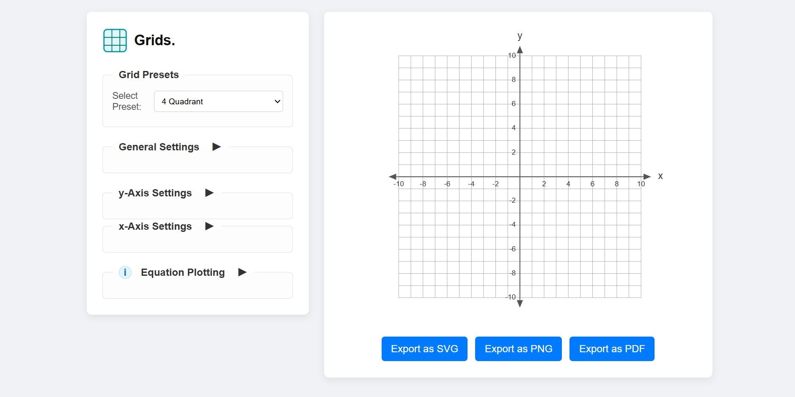

# Grids.

**Grids.** is a powerful, fully client-side SVG grid generator and equation plotter. Designed for precision and flexibility, it lets you create customizable Cartesian-style graph paper and plot mathematical functions — then export your creations in multiple formats.

 

## ✨ Features

- 🧮 **Plot equations** with beautiful mathematical notation using MathJax
- 🔲 **Adjust grid size**, line spacing, and label frequency
- 🖋 **Enable/disable axis labels**, choose fonts, style labels, and units
- 📐 Generate and save **custom grid templates**
- 📍 **Plot points and segments** with smart label positioning
- 📊 Create **smooth curves** with adjustable curve intensity
- 📥 **Bulk enter points** with coordinates, labels, and curve settings
- 💾 **Save and load point sets** with complete grid configurations
- 🎯 **Area calculation** for curves with positive/negative regions
- 📤 **Export as SVG, PNG, or PDF** with perfect rendering
- ✨ **Smart slope continuity** for continuous motion curves
- ✏️ **Draggable labels** for points and equations
- 📝 **Native SVG math** for perfect exports in any application
- 📦 **Zero dependencies** (uses MathJax CDN)

## 🚀 Try It Live

Launch the app directly in your browser:  
🔗 **[https://AtreyuArtax.github.io/grids](https://AtreyuArtax.github.io/grids)**  

> No installation or build tools required — just open `index.html`.
> PWA compatability.

## 🧭 How to Use

1. Open the app in a modern browser
2. Choose your grid size and layout
3. Toggle axes, labels, and formatting options
4. Plot equations with beautiful mathematical notation
5. Drag equation labels to perfect positions
6. Export in SVG, PNG, or PDF format

### 📊 Equation Support

- Write equations using standard mathematical notation
- Support for functions, inequalities, and custom notation
- Beautiful rendering powered by MathJax
- Labels automatically position near equations
- Drag labels anywhere on the grid

### 📍 Points & Curves

- Plot individual points with optional labels
- Connect points with straight lines or smooth curves
- Adjust curve intensity for natural motion
- Bulk import points with x,y coordinates and labels
- Smart slope continuity for physics simulations
- Calculate areas under curves
- Save and load point sets with grid settings
- Drag point labels for perfect positioning

###  Export Options

- **SVG**: Perfect vector output with embedded math
- **PNG**: High-quality raster images
- **PDF**: Professional print-ready output
- All formats preserve mathematical notation
- Exports work perfectly in Word, Google Docs, etc.

## 🗂 Project Structure

```bash
Grids/
├── index.html           # Main application UI
├── css/
│   └── style.css       # Visual styling
├── js/
│   ├── main.js         # UI and event handling
│   ├── plotter.js      # Drawing grid and plotted equations
│   ├── utils.js        # Utility functions
│   ├── labels.js       # Dynamic label logic
│   ├── grid-presets.js # Predefined grid templates
│   ├── equations.js    # Equation parsing and plotting
│   ├── modalInit.js    # Modal dialog handling
│   ├── pointSets.js    # Point plotting functionality
│   └── userTemplates.js # User-defined grid templates
├── modules/            # Modular components
│   ├── errorHandler.js # Error handling system
│   ├── gridAPI.js     # Grid manipulation API
│   ├── modalManager.js # Modal window management
│   ├── pointsLayer.js  # Point plotting layer
│   └── pointsUI.js    # Point interface controls
├── sw.js              # Service worker (offline support)
├── manifest.json      # PWA configuration
└── README.md         # Project documentation
```

## ⚙ Technologies Used

- HTML5 + CSS3 + Modern JavaScript
- SVG for scalable, high-quality rendering
- MathJax for beautiful mathematical notation
- Service Workers for offline capability
- Math parsing for live equation plotting

## 📌 Roadmap

- [ ] Custom color themes and accessibility modes

## 🤝 Contributing

Interested in contributing? Feel free to fork, submit pull requests, or open issues with ideas, bugs, or feature suggestions.

## 📄 License

MIT License — free for personal, educational, or commercial use.

---

Built with care by [@AtreyuArtax](https://github.com/AtreyuArtax)
